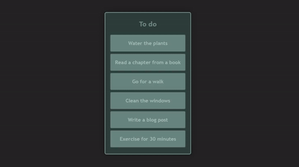

<h1 align="center">Drag and Drop React Practice 🖱️</h1>

  

A simple practice using React and the react-beautiful-dnd library for smooth drag and drop functionality.

## What I Learned

- Implementing drag and drop functionality using the `react-beautiful-dnd` library.
- Utilizing Draggable and Droppable components to achieve seamless user interactions.

## Technologies Used

- React
- react-beautiful-dnd

## Demo

You can try out the drag and drop with [this demo](https://www.flaviotacca.live/drag-and-drop-react/).
